<p align="center">
  
</p>


Repositório de estudo progressivo das disciplinas algoritmos e estruturas de dados I II III na linguagem C do IFMG. O conteúdo reúne materiais das aulas, explicações organizadas por nível, exercícios práticos feitos a mão e documentação de referência.

## Objetivos

- Consolidar os fundamentos da linguagem C por meio de estudo e prática.
- Evoluir de conceitos básicos até avançados de maneira documentada.
- Preservar o histórico de tentativas e aprendizado das resoluções.
- Manter referências oficiais e materiais complementares no mesmo projeto.


## Organização do repositório

```text
.
├── 00_material_aula_ifmg/
│   ├── atividades/          # listas de exercícios da disciplina
│   └── aulas/               # slides e exemplos apresentados em aula
├── 01_explicacao_da_ia/     # conteúdo didático organizado por nível
├── 02_praticas/             # resoluções, tentativas, anotações e dúvidas
├── 03_material_extra/
│   ├── doc_auxiliares/      # manuais e materiais complementares
│   └── doc_c_oficial/       # cppreference e padrão ISO C11
├── AGENTS.md                # regras e arquitetura do projeto
├── index.md                 # índice detalhado de conteúdos e fontes
└── log.md                   # histórico de atividades de estudo
```


## Convenções das práticas

- Cada lista possui uma pasta própria em `02_praticas/`.
- Exercícios adicionais são agrupados em pastas no padrão `ia_NN_nome_do_tema`, nessas pastas, `ex1.c`, `ex2.c` e `ex3.c` representam, respectivamente, os níveis fácil, intermediário e difícil.
- O histórico de tentativas deve ser preservado para acompanhar a evolução das soluções.
- Binários compilados não devem ser adicionados ao repositório.

## Referências

- [Índice das fontes de linguagem C](index.md#fontes-ingeridas)
- [Documentação oficial e cppreference](03_material_extra/doc_c_oficial/)
- [Padrão ISO/IEC 9899:2011 — C11](03_material_extra/doc_c_oficial/ISO_IEC9899_2011.pdf)
- [Manual auxiliar de sintaxe C](03_material_extra/doc_auxiliares/web_sintaxe_c.pdf)

## Estado do projeto

O repositório está em evolução contínua conforme novos conteúdos são estudados, exercícios são resolvidos e dúvidas são registradas.
